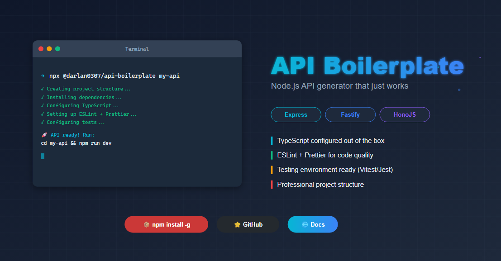

# Api Boilerplate (CLI)

> You can also read in **[English](./README.md)** 🇺🇸

## 📋 Introdução

Uma ferramenta de linha de comando (CLI) que acelera o desenvolvimento de APIs em Node.js, gerando templates pré-configurados com as melhores práticas. Inclui configurações prontas para docker, documentação, linting, typeScript, testes e arquitetura bem estruturada.

**📦 [Disponível no NPM](https://www.npmjs.com/package/@darlan0307/api-boilerplate)**

### 🛠️ Frameworks Suportados

Escolha entre os principais frameworks do ecossistema Node.js:

- **[Express](https://expressjs.com/)**
- **[Fastify](https://fastify.dev/)**
- **[HonoJS](https://hono.dev/)**

### 🚀 Instalação e Uso

###### Uso Direto (Recomendado)

```bash
npx @darlan0307/api-boilerplate <nome-do-projeto>
```

###### Instalação Global

```bash
npm install -g @darlan0307/api-boilerplate
@darlan0307/api-boilerplate <nome-do-projeto>
```

###### Demonstração

[](https://www.youtube.com/watch?v=RRv9dDtHyng)

### ⚙️ Opções Disponíveis

| Flag                | Descrição                                                                                                                                                                    |
| ------------------- | ---------------------------------------------------------------------------------------------------------------------------------------------------------------------------- |
| `-f, --force`       | Sobrescreve o diretório se já existir                                                                                                                                        |
| `-r, --root`        | Cria o template na raiz atual (ao invés de criar uma nova pasta)                                                                                                             |
| `--stack <type>`    | Define o framework: `express`, `fastify` ou `hono`                                                                                                                           |
| `--lint`            | Configura automaticamente [ESLint](https://eslint.org/) e [Prettier](https://prettier.io/)                                                                                   |
| `-t, --tests`       | Prepara ambiente para testes unitários ([Vitest](https://vitest.dev/), [Jest](https://jestjs.io/pt-BR/) ou [Node Test Runner](https://nodejs.org/api/test.html#test-runner)) |
| `--docker`          | Gera configuração [Docker](https://www.docker.com/) (Dockerfile.dev e docker-compose.yml)                                                                                    |
| `--database <type>` | Configura banco de dados: `postgres`, `mysql` ou `mongodb` (requer --docker)                                                                                                 |
| `--api-docs`        | Adiciona documentação de API com Swagger/OpenAPI                                                                                                                             |

### 💡 Exemplos de Uso

#### Uso Interativo (com prompts)

```bash
npx @darlan0307/api-boilerplate minha-api
```

#### Configuração Rápida com Flags

```bash
# API completa com Express, Docker, PostgreSQL e documentação
npx @darlan0307/api-boilerplate minha-api --stack express --docker --database postgres --api-docs --lint --tests

# API simples com Fastify
npx @darlan0307/api-boilerplate minha-api --stack fastify --lint
```

### 🏗️ Arquitetura

```
minha-api/
├── src/
│   ├── @types/
│   ├── app/
│   │   └── v1/
│   ├── infra/
│   │   ├── errors/          # Tratamento de erros
│   │   ├── middlewares/     # Middlewares customizados
│   │   └── logger.ts        # Sistema de logs (Pino)
│   ├── shared/
│   │   └── swagger/
│   ├── http-server.ts
│   └── main.ts
├── docs/
│   └── openapi/
├── .env
├── .env.example
├── .gitignore
├── Dockerfile.dev           # Se --docker
├── docker-compose.yml       # Se --docker (com banco de dados se especificado)
├── package.json
├── README.md
├── tsconfig.build.json
└── tsconfig.json
```

#### 📂 Descrição dos Diretórios

- **main.ts**: Ponto de entrada da aplicação, onde configurações são carregadas e a API é iniciada
- **http-server.ts**: Configuração do servidor HTTP
- **app/v1**: Rotas versionadas da API, facilitando manutenção e evolução
- **infra**: Recursos essenciais ao funcionamento do sistema (logs, errors, middlewares)
- **shared**: Classes e funções genéricas reutilizáveis em toda a aplicação
- **shared/swagger**: Configuração da documentação Swagger/OpenAPI (gerado com `--api-docs`)
- **docs/openapi**: Arquivos YAML modulares para documentação (apenas Express)
- **@types**: Tipagens globais adicionais de bibliotecas/frameworks

### ✨ Funcionalidades Principais

- **3 Frameworks Suportados** - Express, Fastify e HonoJS
- **Versionamento de Rotas** - `/api/v1` com estrutura escalável
- **Documentação API** - Swagger/OpenAPI configurado para cada framework
- **Docker & Docker Compose** - Containerização pronta para desenvolvimento
- **Bancos de Dados** - PostgreSQL, MySQL e MongoDB pré-configurados
- **TypeScript** - Type-safety e autocompletar
- **Testes** - Suporte para Vitest, Jest ou Node Test Runner
- **Linting & Formatting** - ESLint + Prettier configurados
- **Logger** - Pino para logs estruturados
- **Segurança** - Helmet, CORS e Compression configurados

### 🔥 Próximas Funcionalidades

- **Cache** - Implementação de Redis
- **Autenticação** - Templates com JWT e OAuth2
- **ORM/ODM** - Prisma, TypeORM ou Mongoose
- **Notificações** - Templates para email e webhooks

### 🤝 Contribuições

Contribuições são muito bem-vindas! Siga os passos abaixo:

1. **Fork** o repositório
2. **Clone** seu fork localmente
3. **Instale** as dependências: `npm install`
4. **Crie** uma branch para sua feature: `git checkout -b feature/nova-funcionalidade`
5. **Desenvolva** usando: `npm run dev` (executa TypeScript com TSX)
6. **Verifique** seu código:
   - `npm run typecheck` - Verifica tipos do TypeScript
   - `npm run lint` - Executa o linter
   - `npm run format` - Formata o código
7. **Build**: `npm run build` para compilar
8. **Commit** suas alterações: `git commit -m 'feat: adiciona nova funcionalidade'`
9. **Push** para sua branch: `git push origin feature/nova-funcionalidade`
10. **Abra** um Pull Request explicando suas mudanças

#### 📦 Tecnologias Utilizadas no CLI

- **TypeScript** - Linguagem principal
- **Commander.js** - Framework para CLI
- **Inquirer.js** - Prompts interativos
- **Chalk** - Colorização de terminal
- **Ora** - Spinners de carregamento
- **Vitest** - Framework de testes
- **ESLint + Prettier** - Qualidade de código

### 🐛 Reportando Bugs

Encontrou um problema? [Abra uma issue](../../issues) com:

- Descrição detalhada do erro
- Passos para reproduzir
- Ambiente (OS, Node.js version, etc.)

### 📄 Licença

Esse projeto está sob a licença (MIT) - acesse os detalhes [aqui](./LICENSE).

### 👨‍💻 Autor

**Darlan Martins**

- 💼 [LinkedIn](https://www.linkedin.com/in/darlan-martins-8a7956259/)
- 📧 [Entre em contato](mailto:darlanchagas2020@gmail.com)

---

⭐ **Gostou do projeto?** Dê uma estrela no repositório para apoiar o desenvolvimento!
