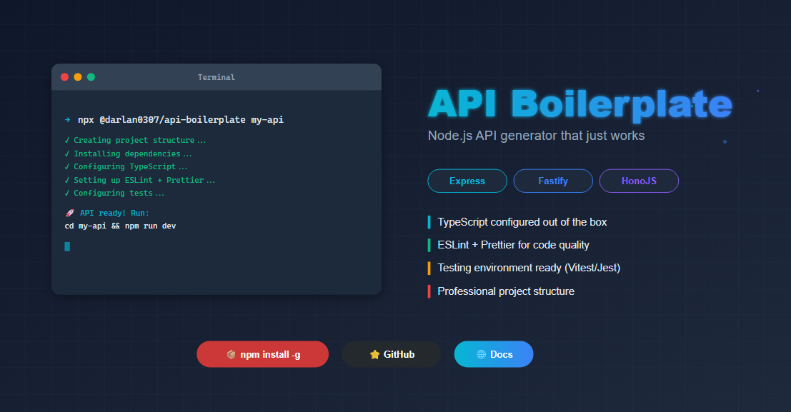

# Api Boilerplate (CLI)

> Você também pode ler em **[Português](./README-pt.md)** 🇧🇷

## 📋 Introduction

A command-line tool (CLI) that speeds up the development of APIs in Node.js by generating pre-configured templates with best practices. It includes ready-made configurations for docker, documentation, linting, typeScript, testing and a well-structured architecture.

**📦 [Available on NPM](https://www.npmjs.com/package/@darlan0307/api-boilerplate)**

### 🛠️ Supported Frameworks

Choose from the main frameworks in the Node.js ecosystem:

- **[Express](https://expressjs.com/)**
- **[Fastify](https://fastify.dev/)**
- **[HonoJS](https://hono.dev/)**

### 🚀 Installation & Use

###### Direct Use (Recommended)

```bash
npx @darlan0307/api-boilerplate <project-name>
```

###### Global Installation

```bash
npm install -g @darlan0307/api-boilerplate
api-boilerplate <project-name>
```

###### Demonstration

[](https://www.youtube.com/watch?v=RRv9dDtHyng)

### ⚙️ Available Options

| Flag                | Description                                                                                                                                                               |
| ------------------- | ------------------------------------------------------------------------------------------------------------------------------------------------------------------------- |
| `-f, --force`       | Overwrite the directory if it already exists                                                                                                                              |
| `-r, --root`        | Creates the template in the current root (instead of creating a new folder)                                                                                               |
| `--stack <type>`    | Define the framework: `express`, `fastify` or `hono`                                                                                                                      |
| `--lint`            | Configures automatically [ESLint](https://eslint.org/) and [Prettier](https://prettier.io/)                                                                               |
| `-t, --tests`       | Prepares environment for unit tests ([Vitest](https://vitest.dev/), [Jest](https://jestjs.io/pt-BR/) or [Node Test Runner](https://nodejs.org/api/test.html#test-runner)) |
| `--docker`          | Generate [Docker](https://www.docker.com/) configuration (Dockerfile.dev and docker-compose.yml)                                                                          |
| `--database <type>` | Configure database: `postgres`, `mysql` or `mongodb` (requires --docker)                                                                                                  |
| `--api-docs`        | Add API documentation with Swagger/OpenAPI                                                                                                                                |

### 💡 Usage Examples

#### Interactive Mode (with prompts)

```bash
npx @darlan0307/api-boilerplate my-api
```

#### Quick Setup with Flags

```bash
# Complete API with Express, Docker, PostgreSQL and documentation
npx @darlan0307/api-boilerplate my-api --stack express --docker --database postgres --api-docs --lint --tests

# Simple API with Fastify
npx @darlan0307/api-boilerplate my-api --stack fastify --lint
```

### 🏗️ Architecture

```
my-api/
├── src/
│   ├── @types/
│   ├── app/
│   │   └── v1/
│   ├── infra/
│   │   ├── errors/          # Error handling
│   │   ├── middlewares/     # Custom middlewares
│   │   └── logger.ts        # Logging system (Pino)
│   ├── shared/
│   │   └── swagger/
│   ├── http-server.ts
│   └── main.ts
├── docs/
│   └── openapi/
├── .env
├── .env.example
├── .gitignore
├── Dockerfile.dev           # If --docker
├── docker-compose.yml       # If --docker (with database if specified)
├── package.json
├── README.md
├── tsconfig.build.json
└── tsconfig.json
```

#### 📂 Directory Descriptions

- **main.ts**: Application entry point where configurations are loaded and the API starts
- **http-server.ts**: HTTP server configuration
- **app/v1**: Versioned API routes, facilitating maintenance and evolution
- **infra**: Essential system resources (logs, errors, middlewares)
- **shared**: Generic reusable classes and functions throughout the application
- **shared/swagger**: Swagger/OpenAPI documentation configuration (generated with `--api-docs`)
- **docs/openapi**: Modular YAML files for documentation (Express only)
- **@types**: Additional global type definitions for libraries/frameworks

### ✨ Main Features

- **3 Supported Frameworks** - Express, Fastify and HonoJS
- **Route Versioning** - `/api/v1` with scalable structure
- **API Documentation** - Swagger/OpenAPI configured for each framework
- **Docker & Docker Compose** - Ready-to-use containerization for development
- **Databases** - Pre-configured PostgreSQL, MySQL and MongoDB
- **TypeScript** - Type-safety and autocompletion
- **Tests** - Support for Vitest, Jest or Node Test Runner
- **Linting & Formatting** - ESLint + Prettier configured
- **Logger** - Pino for structured logs
- **Security** - Helmet, CORS and Compression configured

### 🔥 Next Features

- **Cache** - Redis implementation
- **Authentication** - Templates with JWT and OAuth2
- **ORM/ODM** - Prisma, TypeORM or Mongoose
- **Notifications** - Templates for email and webhooks

### 🤝 Contributions

Contributions are very welcome! Follow the steps below:

1. **Fork** the repository
2. **Clone** your fork locally
3. **Install** dependencies: `npm install`
4. **Create** a branch for your feature: `git checkout -b feature/new-feature`
5. **Develop** using: `npm run dev` (runs TypeScript with TSX)
6. **Check** your code:
   - `npm run typecheck` - Check TypeScript types
   - `npm run lint` - Run the linter
   - `npm run format` - Format code
7. **Build**: `npm run build` to compile
8. **Commit** your changes: `git commit -m 'feat: adds new feature'`
9. **Push** to your branch: `git push origin feature/new-feature`
10. **Open** a Pull Request explaining your changes

#### 📦 Technologies Used in CLI

- **TypeScript** - Main language
- **Commander.js** - CLI framework
- **Inquirer.js** - Interactive prompts
- **Chalk** - Terminal colorization
- **Ora** - Loading spinners
- **Vitest** - Testing framework

### 🐛 Reporting Bugs

Found a problem? [Open an Issue](../../issues) with:

- Detailed error description
- Steps to reproduce
- Environment (OS, Node.js version, etc.)

### 📄 License

This project is under the (MIT) license - find the details [here](./LICENSE).

### 👨‍💻 Author

**Darlan Martins**

- 💼 [LinkedIn](https://www.linkedin.com/in/darlan-martins-8a7956259/)
- 📧 [Contact](mailto:darlanchagas2020@gmail.com)

---

⭐ **Liked the project?** Give a star to the repository to support the development!
